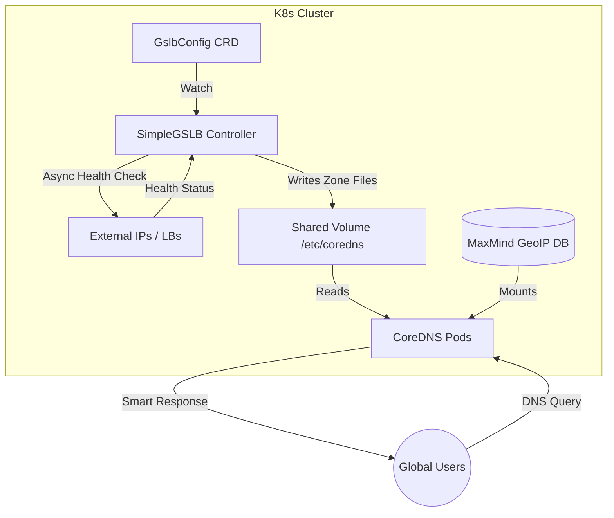

# SimpleGSLB

**SimpleGSLB** is a lightweight, Kubernetes-native Global Server Load Balancing (GSLB) solution designed specifically for **BareMetal clusters**, **Hybrid Clouds**, and environments dependent on **External Load Balancers**.

It acts as a self-hosted authoritative DNS controller that **actively monitors target health** (HTTP/TCP) and dynamically updates CoreDNS records based on `GslbConfig` Custom Resource Definitions (CRDs).

> **Open Source Notice:** This project is released under the **MIT License**. You are free to copy, modify, distribute, and use it in your infrastructure—commercial or personal—without restriction.

---

## 🧐 Is this the right tool for you? (Alternatives)

**SimpleGSLB is a niche tool.** It is designed to fill a specific automation gap in on-premise/bare-metal environments. If your infrastructure fits a standard cloud pattern, **other tools are likely better**.

Please check this table before adopting:

| Solution                           | Best For...                        | The Limitation / Why use SimpleGSLB instead?                                                                                                                             |
| :--------------------------------- | :--------------------------------- | :----------------------------------------------------------------------------------------------------------------------------------------------------------------------- |
| **AWS Route53 / Google Cloud DNS** | **Public Cloud Users.**            | **Vendor Lock-in.** If you are 100% on AWS, use Route53. Use SimpleGSLB only for Hybrid/On-Prem scenarios.                                                               |
| **ExternalDNS**                    | **Syncing K8s Services to DNS.**   | **No Health Checks.** ExternalDNS assumes if a Service exists, the IP is alive. It cannot detect if the path to an external Load Balancer is broken.                     |
| **k8gb**                           | **Cloud Native Ingress (GSLB).**   | **Tightly Coupled to Ingress.** k8gb is excellent but relies on Ingress status. It is difficult to use if your entry point is a detached BGP VIP or legacy Firewall.     |
| **SimpleGSLB**                     | **BareMetal / Static IPs / Edge.** | **Manual Definition.** You must define Target IPs in the CRD. It is designed for scenarios where you _need_ explicit control over external IPs + Active Health Checking. |

---

## 🚀 The Problem (Why this exists)

In many **BareMetal** or **Hybrid** setups, the "Entry Point" IP is often decoupled from Kubernetes:

1.  **Decoupled Entry Points:** You might use BGP Anycast, a Firewall VIP, or a hardware F5/HAProxy that sits _outside_ the cluster.
2.  **The "Silent Failure":** Existing tools like ExternalDNS will resolve a DNS record even if the backend Load Balancer is down, causing traffic blackholes.

**SimpleGSLB** bridges this gap. It allows you to define these "detached" targets and lets the controller handle the **Liveness Verification** and **DNS Routing**.

---

## 🏗 Architecture

SimpleGSLB separates the **Control Plane** (Python Controller) from the **Data Plane** (CoreDNS) for stability.



---

## ✨ Key Features

- **Active Health Checking**:
  - **HTTP/HTTPS**: Probes endpoints and validates status codes (2xx).
  - **TCP**: Verifies port connectivity.
  - _Result:_ Unhealthy targets are immediately removed from DNS responses.
- **Smart Routing Strategies**:
  - **GeoDNS**: Returns the nearest endpoint based on the client's source IP (Split-Horizon).
  - **Weighted Round-Robin**: Distribute traffic load (e.g., Primary DC `weight: 10` vs. Backup DC `weight: 1`).
  - **Automatic Fallback**: If a region fails, traffic fails over to a global default pool.

---

## 📋 Prerequisites

- **Kubernetes Cluster** (v1.20+)
- **Helm** (v3+)
- **MaxMind Account** (Free or Paid): You need an Account ID and License Key for `GeoLite2-City` to enable GeoDNS features.

---

## 📦 Installation

This chart is hosted on GitHub Pages.

1.  **Add the Helm Repository:**

    ```bash
    helm repo add simple-gslb https://cyberun-cloud.github.io/simple-gslb/
    helm repo update
    ```

2.  **Install the Chart:**

    ```bash
    helm upgrade --install simplegslb simple-gslb/simplegslb \
      --namespace gslb-system --create-namespace \
      --set controller.geoip=true \
      --set geoip.account="YOUR_ACCOUNT_ID" \
      --set geoip.license="YOUR_LICENSE_KEY"
    ```

    ### Example: Common `values.yaml` Options

    | Key                | Default Value       | Description                                      |
    | ------------------ | ------------------- | ------------------------------------------------ |
    | `mode`             | `controller`        | Deployment mode (usually leave as `controller`). |
    | `interval`         | `10`                | Health check interval (seconds).                 |
    | `timeout`          | `2`                 | Health check timeout (seconds).                  |
    | `image.repository` | `myrepo/simplegslb` | Controller image repository.                     |
    | `image.tag`        | `latest`            | Image tag to deploy.                             |
    | `image.pullPolicy` | `IfNotPresent`      | Image pull policy.                               |
    | `service.type`     | `ClusterIP`         | Kubernetes Service type for controller.          |
    | `controller.geoip` | `false`             | Enable GeoIP-based routing.                      |
    | `geoip.account`    | `""`                | MaxMind GeoIP account ID (required if GeoIP).    |
    | `geoip.license`    | `""`                | MaxMind GeoIP license key (required if GeoIP).   |

---

## ⚙️ Configuration Example

**Scenario:**

- **US Users**: Route to `1.1.1.1` (Port 80 HTTP Check).
- **Japan Users**: Route to `2.2.2.2` (Port 443 TCP Check).
- **Everyone Else (or failure)**: Fallback to `8.8.8.8`.

<!-- end list -->

```yaml
apiVersion: cyberun.cloud/v1
kind: GslbConfig
metadata:
  name: my-global-app
spec:
  domain: "app.example.com"
  nameservers:
    - hostname: "ns1.example.com"
      address: "192.168.1.50"
  records:
    - name: "www"
      targets:
        # --- Region A Node ---
        - address: "1.1.1.1"
          location: "US" # ISO 3166-1 Alpha-2 Code
          weight: 10
          protocol: "http"
          port: 80
          path: "/healthz"

        # --- Region B Node ---
        - address: "2.2.2.2"
          location: "JP"
          weight: 10
          protocol: "tcp"
          port: 443

        # --- Global Fallback Node ---
        - address: "8.8.8.8"
          # location: ""    # Empty location = Global Default
          weight: 1
          protocol: "http"
```

---

## 🚧 Roadmap & Known Issues

This project is actively developed. Please note the current limitations:

- **CRD Status**: Health status is currently only visible via controller logs or DNS query results. `kubectl get gslbconfig` status updates are coming soon.
- **IPv6 Support**: Currently generates `A` records (IPv4) only. `AAAA` support is planned.
- **Observability**: Prometheus metrics are not yet exposed.
- **UDP Checks**: Health checks currently support `http`, `https`, and `tcp`.

## 🤝 Contributing

Contributions are welcome\! Please feel free to submit a Pull Request.
